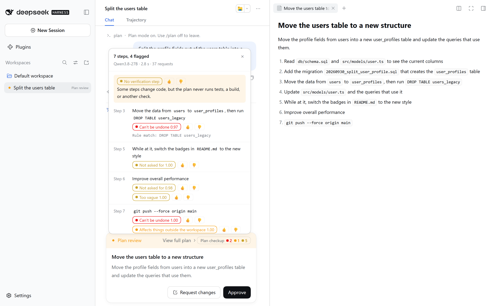
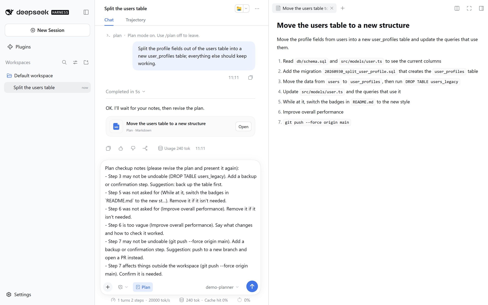

# dsh-plan-checkup · Plan Checkup

English · [简体中文](README.zh-CN.md) · [繁體中文](README.zh-TW.md)

A plugin for [DeepSeek Harness](https://github.com/deepseek-ai/deepseek-harness) (dsh). When the agent hands in a plan in plan mode, Plan Checkup reads it step by step before you approve it, and marks what it finds on the plan review card.



| Flag | Meaning | Found by |
|---|---|---|
| 🔴 Can't be undone | Deletes or overwrites existing data, history or resources | Command rules (`DROP TABLE`, `rm -rf`, `git push --force`, …) or the judgment engine |
| 🟠 Affects things outside the workspace | Touches a remote repository, a shared or production system, other people, or a paid service | Command rules (`git push`, `npm publish`, `kubectl apply`, …) or the judgment engine |
| 🟡 Not asked for | Work the request did not ask for | Judgment engine |
| 🟡 Too vague | Doesn't say what will be changed or checked | Judgment engine |
| 🟡 No verification step (whole plan) | Some step changes code, but nothing runs tests or a build | Rules and the judgment engine |
| 🟡 May miss part of the request (whole plan) | The plan doesn't cover everything that was asked | Judgment engine |

It only advises. It never blocks, rewrites or approves a plan, and nothing leaves your machine until you set up a judgment engine.

## What you see

1. In dsh web, type `/plan` to turn on plan mode, then send your request.
2. When the agent hands in its plan, a **Plan checkup** badge appears in the review card's toolbar, next to the link that opens the full plan. Rule flags show at once; the badge shows progress (for example *Checking 3/8*) while the engine works through the steps, then the number of flags in each color, or *No issues found*.
3. Click the badge for the details: each flagged step, the flags with their probabilities, the commands a rule matched, and the notes about the whole plan. Each flag has 👍 / 👎 buttons; your votes are kept in a local file and can be used to recalibrate thresholds later.
4. To have the agent revise the plan, click **Put in the message box**, then **Request changes** on the card. The message box then holds a ready-made list of the problems, which you can edit and send. **Copy feedback** copies the same text.
5. **Approve** runs the plan as usual.



If the engine can't be reached, the badge says *Rules only*, the panel gives the reason, and the review goes on normally.

## Requirements

- dsh 0.2.x. Tested on dsh 0.2.0-rc.2 (Windows 11, Node.js 24.21) with the web profile.
- Node.js 22.19 or later in the 22 line, or 24 and later (the same as dsh).
- For anything beyond the command rules, a judgment engine (next section).

## Install

```bash
dsh plugin --profile web add dsh-plan-checkup
```

If you run dsh through npx, use `npx @deepseek-ai/dsh plugin --profile web add dsh-plan-checkup`. Restart `dsh web` afterwards. Until a judgment engine is configured, only the command rules run and the badge says *Rules only*.

To remove it, run `dsh plugin --profile web remove dsh-plan-checkup` and delete the `plan-checkup` entry from your profile's `cordis.patch.yml` if you added one.

## Set up a judgment engine

Settings go in your profile's `cordis.patch.yml` (for the web profile, `~/.dsh/profiles/web/cordis.patch.yml`). An entry with `id: plan-checkup` replaces the plugin's whole `config`; keys you leave out keep their defaults.

### Option 1: an OpenAI-compatible endpoint (no Jev key needed)

Each question becomes a lettered multiple-choice question. The model outputs a single token, and the plugin reads the probability of each option letter from the logprobs; it never parses free text. The endpoint must support `logprobs` and `top_logprobs`, for example vLLM, SGLang, llama.cpp, or Ollama 0.12.11 and later.

A vLLM server on your LAN over plain http:

```yaml
- id: plan-checkup
  config:
    engine: llm
    llm:
      endpoint: http://10.0.0.20:8000/v1/chat/completions
      model: Qwen3.8-27B
      allowEgress: true            # plan text is sent to this host
      allowHttpHosts: [10.0.0.20]  # allow plain http to this host
      extraBody:
        chat_template_kwargs:
          enable_thinking: false   # turn thinking off on reasoning models
```

Loopback endpoints (`127.0.0.1`, `localhost`) don't need `allowEgress`. If the endpoint needs a key, store it as a dsh credential or an environment variable and name it in `llm.apiKeyEnv`.

When thinking is left on, the first token is `<think>` instead of an option letter; the checkup falls back to the rules, and the panel says the engine's response was in the wrong format.

Before connecting dsh, you can check an endpoint from a clone of this repository:

```bash
npm run probe -- --endpoint http://10.0.0.20:8000/v1/chat/completions --model Qwen3.8-27B \
  --allow-egress --allow-http-host 10.0.0.20 --extra '{"chat_template_kwargs":{"enable_thinking":false}}'
```

It runs a built-in 7-step plan (or `--plan <file>`) and prints the probabilities and flags for each step.

### Option 2: TypeSafe Jev, or a server with the same API

**TypeSafe cloud:** store your key as `TYPESAFE_API_KEY` (a dsh credential or an environment variable), then allow sending:

```yaml
- id: plan-checkup
  config:
    jev:
      allowEgress: true
```

**A Jev-compatible server** such as Laya or openjev: point the endpoint at it. Loopback servers don't need `allowEgress`.

```yaml
- id: plan-checkup
  config:
    jev:
      endpoint: http://127.0.0.1:8791/v1/systemone
```

In our evaluation, pretrained Laya scored close to chance on these questions; fine-tune it on your own data before relying on it. The default thresholds were calibrated on Qwen3.8-27B and have not been checked against Jev.

## What leaves your machine

| Item | Details |
|---|---|
| Sent | Your last 3 requests (up to 2,000 characters), the plan title, the step being checked (up to 1,200 characters), and the first line of the steps before and after it |
| Not sent | Repository files, tool output, the rest of the conversation |
| Masked before sending | API keys and tokens (`sk-`, `ghp_`, `AKIA`, `apikey_`, …), `Bearer …`, private key blocks, URLs with credentials, `password=` |
| Endpoint rules | Loopback endpoints are always allowed. Others need `allowEgress: true`, and must use https or be listed in `allowHttpHosts` |
| Requests | Jev: one per step. OpenAI-compatible: one per question (about 37 for 7 steps; a step's text is sent with each of its questions) |
| Keys | Only in the Authorization header; never logged and never sent to the browser |

## Settings

The full defaults are in [cordis.patch.yml](cordis.patch.yml). The common keys:

| Key | Default | Meaning |
|---|---|---|
| `engine` | `jev` | Judgment engine: `jev` or `llm` |
| `lang` | `auto` | Language of the card and the feedback text: `auto` follows the dsh UI (Simplified Chinese or English); `zh-TW`, `zh-CN` or `en` force one |
| `promptLang` | `en` | Language of the questions sent to the engine: `en` or `zh`. Changing it changes the probabilities, so re-check the thresholds |
| `jev.model` | `jev-1.13.0` | Pinned, because thresholds are calibrated per model version |
| `jev.timeoutMs` / `jev.totalTimeoutMs` | `2500` / `4000` | Time budget per request and per plan; past it, only finished results are shown |
| `llm.model` | (empty) | Required: the model name the endpoint serves |
| `llm.extraBody` | `{}` | Merged into each request, for example to turn thinking off. It can't override the fields used to read probabilities, such as `max_tokens` and `logprobs` |
| `llm.swapOptions` | `false` | Ask each question in both option orders and average (twice the requests) |
| `llm.temperature` | `1` | Calibration temperature; above 1 pulls probabilities toward 0.5 |
| `llm.timeoutMs` / `llm.totalTimeoutMs` | `5000` / `20000` | As above; a local model takes more requests, so the budget is wider |
| `*.allowHttpHosts` | `[]` | Non-loopback hosts that may be reached over plain http: host name or IP only, no port |
| `thresholds.*` | 0.4–0.8 | Per-flag thresholds, calibrated on Qwen3.8-27B |
| `limits.maxSteps` | `25` | Steps past this only get the command rules |

## Where data is stored

In `$DSH_HOME/plan-checkup/` (by default `~/.dsh/plan-checkup/`):

- `results/<session>_<callId>.json`: the result for each plan, so it is still there when you reopen the plan.
- `ledger.jsonl`: for each checkup, the engine, the probability of each answer, latency and token counts, the plan title, your decision (approve or request changes) and your 👍 / 👎 votes. It doesn't contain the step text.

The plugin never writes to the session log.

## How well it works

We evaluated it on synthetic plans with deliberately planted problems (code and data in [eval/](eval/README.md)): 210 plans to tune the questions and thresholds, then 90 held-out plans from 6 new scenarios. Precision / recall of the card's flags on the held-out set:

| Flag | Qwen3.8-27B (OpenAI-compatible, English questions) | Rules only | Pretrained Laya |
|---|---|---|---|
| Can't be undone | 1.00 / 1.00 | 1.00 / 0.35 | 0.07 / 0.80 |
| Affects things outside the workspace | 1.00 / 1.00 | 1.00 / 0.13 | 0.11 / 0.77 |
| Not asked for | 1.00 / 1.00 | — | 0.10 / 0.05 |
| Too vague | 0.74 / 1.00 | — | 0.03 / 0.21 |
| No verification step | 1.00 / 1.00 | 0.59 / 0.94 | 0.50 / 0.03 |
| May miss part of the request | 0.91 / 0.87 | — | 0.28 / 0.70 |

With Qwen3.8-27B on a vLLM server, a plan took 2.1 s at the median and 2.9 s at p95, with about 26 requests. These plans are cleaner than real ones and every one has planted problems, so read the numbers as an upper bound. Plans from a capable agent rarely contain these slips, so on real work expect *No issues found* most of the time.

## Feedback

This is the first public version, and feedback decides what comes next. Open an issue with the [feedback form](https://github.com/Bear0117/dsh-plan-checkup/issues/new?template=feedback.yml). The **Send feedback** link at the bottom of the details panel opens the same form with the plugin version and the engine filled in; nothing is sent until you submit it yourself. Useful things to include:

- the step and the flag that was wrong, or the problem that wasn't flagged;
- your dsh version and judgment engine;
- optionally, an excerpt of the plan (remove anything private) and the matching lines from `ledger.jsonl`.

## Known limitations

- It looks for specific slips: dangerous commands, unrequested work, vague steps, missing tests. It does not judge whether the approach is right or whether the facts a plan relies on are true.
- The questions are written for coding plans. For research or writing plans, most of them don't apply.
- Steps are split from the plan's top-level list or headings; nested items fold into their step, a step longer than 1,200 characters is cut, and sections that aren't steps (goals, background) are not checked.
- If the judgment engine is the same model that wrote the plan, it shares that model's blind spots.
- Thresholds were calibrated on synthetic data with Qwen3.8-27B. Other engines and models need their own check; the probabilities and votes in `ledger.jsonl` can be used for that.
- *May miss part of the request* is the weakest check; treat it as a soft reminder.
- Plans from sub-agents never get a review card (sub-agents can't ask the user), so they are not checked.
- **Request changes** cancels the review, so the feedback is sent by you, not by the plugin.
- It is an advisory tool, not a security boundary: dsh's sandbox and approvals work as before.

## Development

```bash
npm test                  # unit tests, no network or keys needed
npm run dev:llm           # mock planner that always hands in a 7-step plan (port 18765)
npm run dev:jev           # mock Jev that validates requests and returns probabilities (port 18766)
npm run dev:logprobs      # mock logprob endpoint for the llm engine (port 18767)
npm run probe -- …        # test a judgment engine with one plan (see above)
```

`dev/overlay.yml` (mock Jev) and `dev/overlay-llm.yml` (mock logprob endpoint) start a separate test setup where every service runs on loopback and no key is needed:

```bash
DSH_HOME=.m0/home M0_MOCK_API_KEY=mock dsh web --patch dev/overlay-llm.yml --port 3190 --no-open
```

`node dev/screenshot.mjs <dsh-url> <lang> <request> <out.png> [--feedback <out.png>]` retakes the screenshots against a running dsh web, using Edge or Chrome and no extra packages; `MOCK_PLAN_LANG=en` or `zh-CN` makes the mock planner hand in its plan in that language.

The mocks can simulate errors: `MOCK_JEV_MODE=401|402|429|529|slow` and `MOCK_LLM_MODE=401|429|503|slow|nologprobs|think`. The browser half, `lib/client.js`, is written by hand in the dsh client-module format, so there is no build step. Notes on the dsh hooks it relies on are in [m0/README.md](m0/README.md).

## License

[MIT](LICENSE)
