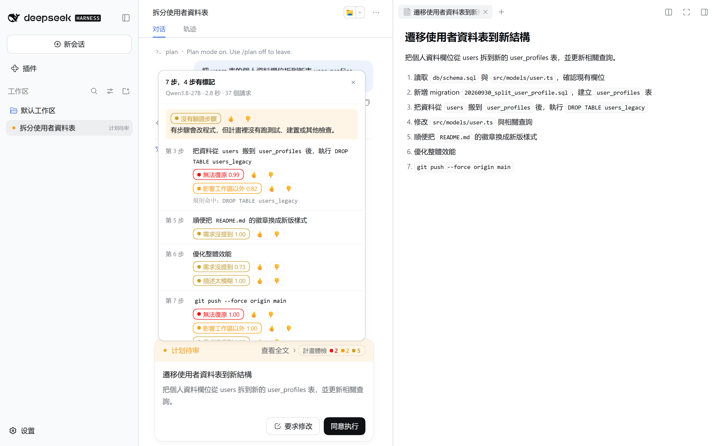

# dsh-plan-checkup · 計畫體檢

[English](README.md) · [简体中文](README.zh-CN.md) · 繁體中文

[DeepSeek Harness](https://github.com/deepseek-ai/deepseek-harness)（dsh）插件。agent 在計畫模式交出計畫、你按「同意執行」之前，它會逐步檢查每一步，把結果標在計畫審閱卡片上。



| 標記 | 意思 | 判斷方式 |
|---|---|---|
| 🔴 無法復原 | 會刪除或覆寫既有的資料、歷史或資源 | 指令規則（`DROP TABLE`、`rm -rf`、`git push --force` 等）或判斷引擎 |
| 🟠 影響工作區以外 | 會動到遠端 repo、共用或正式環境、其他人，或付費服務 | 指令規則（`git push`、`npm publish`、`kubectl apply` 等）或判斷引擎 |
| 🟡 需求沒提到 | 需求沒有要求的工作 | 判斷引擎 |
| 🟡 描述太模糊 | 看不出要改什麼、檢查什麼 | 判斷引擎 |
| 🟡 沒有驗證步驟（整份計畫） | 有步驟會改程式，但沒有跑測試或建置 | 規則加上判斷引擎 |
| 🟡 可能漏了需求（整份計畫） | 計畫沒有涵蓋需求的所有部分 | 判斷引擎 |

它只提示，不擋、不改寫計畫，也不替你核准。設定判斷引擎之前，不會有任何內容離開你的電腦。

## 你會看到什麼

1. 在 dsh web 輸入 `/plan` 進入計畫模式，再送出需求。
2. agent 交出計畫後，審閱卡片的工具列會出現「計畫體檢」徽章，在查看全文的連結旁邊。規則命中的標記馬上出現；引擎檢查期間，徽章顯示進度（例如「體檢中 3/8」），完成後顯示各顏色標記的數量，或「沒發現問題」。
3. 點徽章看細節：每個有標記的步驟、標記與機率、規則命中的指令，以及整份計畫的提醒。每個標記旁有 👍 / 👎，你的投票會記在本機檔案裡，之後可以拿來重新校準門檻。
4. 要讓 agent 改計畫：先按「帶入輸入框」，再按卡片上的「要求修改」。輸入框會出現整理好的問題清單，確認或修改後送出即可。「複製回饋」會複製同樣的文字。
5. 按「同意執行」就照常執行。

連不到判斷引擎時，徽章顯示「只用規則」，面板寫明原因，審閱照常進行。卡片預設跟著 dsh 介面的語言（簡中或英文），要顯示繁中請把 `lang` 設成 `zh-TW`（見「設定」）。

## 需求

- dsh 0.2.x。已在 dsh 0.2.0-rc.2（Windows 11、Node.js 24.21）的 web profile 上實測。
- Node.js 22.19 以上的 22 版，或 24 以上（和 dsh 相同）。
- 指令規則以外的檢查需要判斷引擎（見下一節）。

## 安裝

```bash
dsh plugin --profile web add dsh-plan-checkup
```

如果你用 npx 執行 dsh，改用 `npx @deepseek-ai/dsh plugin --profile web add dsh-plan-checkup`。裝好後重啟 `dsh web`。還沒設定判斷引擎時只跑指令規則，徽章會顯示「只用規則」。

**更新**：執行 `dsh plugin --profile web update dsh-plan-checkup`（用 npx 的話是 `npx @deepseek-ai/dsh plugin --profile web update dsh-plan-checkup`），再重啟 `dsh web`。

- dsh 用 pnpm 安裝插件，而 pnpm 要等新版本發布滿一天才會選它。發布後的第一天，`update` 會停在你現有的版本；想馬上更新，就寫明版本號，例如 `dsh plugin --profile web add dsh-plan-checkup@0.1.1`。
- `update` 只在同一個次版本內更新（0.1.x）。要升到新的次版本（例如 0.2.0），執行 `dsh plugin --profile web add dsh-plan-checkup@latest`，一樣要等新版本滿一天。
- 每個版本改了什麼，見 [Releases 頁面](https://github.com/Bear0117/dsh-plan-checkup/releases)。

移除：執行 `dsh plugin --profile web remove dsh-plan-checkup`；如果你在 profile 的 `cordis.patch.yml` 加過 `plan-checkup` 段落，也一起刪掉。

## 設定判斷引擎

設定寫在 profile 的 `cordis.patch.yml`（web profile 是 `~/.dsh/profiles/web/cordis.patch.yml`）。`id: plan-checkup` 的段落會取代插件的整份 `config`，沒寫到的鍵用預設值。

### 方式一：OpenAI 相容端點（不需要 Jev 金鑰）

每一題會轉成有字母選項的選擇題，模型只輸出 1 個 token，插件從選項字母的 logprob 讀出各選項的機率，不解析模型寫的文字。端點要支援 `logprobs` 和 `top_logprobs`，例如 vLLM、SGLang、llama.cpp，或 Ollama 0.12.11 以上。

區網裡用 http 連的 vLLM：

```yaml
- id: plan-checkup
  config:
    engine: llm
    llm:
      endpoint: http://10.0.0.20:8000/v1/chat/completions
      model: Qwen3.8-27B
      allowEgress: true            # 計畫會送到這台主機
      allowHttpHosts: [10.0.0.20]  # 允許用 http 連這台主機
      extraBody:
        chat_template_kwargs:
          enable_thinking: false   # 推理模型要關掉思考
```

本機端點（`127.0.0.1`、`localhost`）不需要 `allowEgress`。端點要金鑰時，把金鑰存成 dsh 憑證或環境變數，再用 `llm.apiKeyEnv` 指定名稱。

沒關掉思考時，第一個 token 會是 `<think>` 而不是選項字母；這時體檢會退回只用規則，面板會寫明引擎的回應格式不對。

接上 dsh 之前，可以在這個 repo 的副本裡先測端點：

```bash
npm run probe -- --endpoint http://10.0.0.20:8000/v1/chat/completions --model Qwen3.8-27B \
  --allow-egress --allow-http-host 10.0.0.20 --extra '{"chat_template_kwargs":{"enable_thinking":false}}'
```

它用內建的 7 步計畫（或 `--plan <檔案>`）跑一次，印出每一步的機率和標記。

### 方式二：TypeSafe Jev，或 API 相同的服務

**TypeSafe 雲端**：把金鑰存成 `TYPESAFE_API_KEY`（dsh 憑證或環境變數），再打開外送：

```yaml
- id: plan-checkup
  config:
    jev:
      allowEgress: true
```

**和 Jev 相容的服務**，例如 Laya、openjev：把端點指到它。本機服務不需要 `allowEgress`。

```yaml
- id: plan-checkup
  config:
    jev:
      endpoint: http://127.0.0.1:8791/v1/systemone
```

在我們的評測裡，預訓練的 Laya 在這些題目上接近亂猜，請先用自己的資料微調再使用。預設門檻是依 Qwen3.8-27B 校準的，還沒有對 Jev 核對過。

## 會送出去的資料

| 項目 | 內容 |
|---|---|
| 送出 | 你最近 3 則需求（最多 2,000 字）、計畫標題、正在檢查的這一步（最多 1,200 字），以及前後兩步的第一行 |
| 不送 | repo 裡的檔案、工具輸出、其他對話內容 |
| 送出前遮罩 | API key 與 token（`sk-`、`ghp_`、`AKIA`、`apikey_` 等）、`Bearer …`、私鑰區塊、帶帳密的 URL、`password=` |
| 端點限制 | 本機端點不受限；其他端點要 `allowEgress: true`，而且要用 https，或列在 `allowHttpHosts` 裡 |
| 請求數 | Jev 每一步 1 個請求；OpenAI 相容端點每一題 1 個請求（7 步約 37 個，同一步的內容會隨每一題重複送） |
| 金鑰 | 只放在 Authorization 標頭，不寫進紀錄，也不送到瀏覽器 |

## 設定

完整預設值在 [cordis.patch.yml](cordis.patch.yml)。常用的鍵：

| 鍵 | 預設 | 說明 |
|---|---|---|
| `engine` | `jev` | 判斷引擎：`jev` 或 `llm` |
| `lang` | `auto` | 卡片與回饋文字的語言：`auto` 跟著 dsh 介面（簡中或英文）；`zh-TW`、`zh-CN`、`en` 指定其中一種 |
| `promptLang` | `en` | 送給引擎的題目語言：`en` 或 `zh`。改了會影響機率，門檻要重新確認 |
| `jev.model` | `jev-1.13.0` | 釘住版本，因為門檻是針對特定版本校準的 |
| `jev.timeoutMs` / `jev.totalTimeoutMs` | `2500` / `4000` | 單一請求與整份計畫的時間預算，超過就只顯示已完成的結果 |
| `llm.model` | （空） | 必填，端點上的模型名稱 |
| `llm.extraBody` | `{}` | 併入每個請求，例如關掉思考；蓋不掉讀機率要用的欄位，例如 `max_tokens`、`logprobs` |
| `llm.swapOptions` | `false` | 每題正反順序各問一次再平均（請求數加倍） |
| `llm.temperature` | `1` | 校準溫度；大於 1 會讓機率往 0.5 收 |
| `llm.timeoutMs` / `llm.totalTimeoutMs` | `5000` / `20000` | 同上；本機模型請求多，預算較寬 |
| `*.allowHttpHosts` | `[]` | 可以用 http 連的非本機主機，只寫主機名稱或 IP，不含 port |
| `thresholds.*` | 0.4–0.8 | 各標記的門檻，依 Qwen3.8-27B 校準 |
| `limits.maxSteps` | `25` | 超過的步驟只跑指令規則 |

## 資料存在哪裡

在 `$DSH_HOME/plan-checkup/`（預設 `~/.dsh/plan-checkup/`）：

- `results/<session>_<callId>.json`：每份計畫的體檢結果，重開計畫時還看得到。
- `ledger.jsonl`：每次體檢用的引擎、各題答案的機率、延遲與 token 數、計畫標題、你的決定（同意執行或要求修改），以及你的 👍 / 👎。不含步驟內容。

插件不會往 session 紀錄寫任何東西。

## 效果如何

我們用刻意埋了問題的合成計畫做評測（程式與資料在 [eval/](eval/README.md)）：210 份用來調整題目與門檻，再用 6 個新情境的 90 份計畫做最後驗證。驗證集上卡片標記的精確率／召回率：

| 標記 | Qwen3.8-27B（OpenAI 相容端點，英文題目） | 只用規則 | 預訓練 Laya |
|---|---|---|---|
| 無法復原 | 1.00 / 1.00 | 1.00 / 0.35 | 0.07 / 0.80 |
| 影響工作區以外 | 1.00 / 1.00 | 1.00 / 0.13 | 0.11 / 0.77 |
| 需求沒提到 | 1.00 / 1.00 | — | 0.10 / 0.05 |
| 描述太模糊 | 0.74 / 1.00 | — | 0.03 / 0.21 |
| 沒有驗證步驟 | 1.00 / 1.00 | 0.59 / 0.94 | 0.50 / 0.03 |
| 可能漏了需求 | 0.91 / 0.87 | — | 0.28 / 0.70 |

在 vLLM 上用 Qwen3.8-27B，一份計畫的中位數是 2.1 秒、p95 是 2.9 秒，約 26 個請求。這些計畫比真實的乾淨，而且每一份都埋了問題，所以這些數字應該當成上限。能力好的 agent 交出的計畫很少有這些疏失，實際使用時多半會顯示「沒發現問題」。

## 意見回饋

這是第一個公開版本，下一步要做什麼由大家的回饋決定。請用[回饋表單](https://github.com/Bear0117/dsh-plan-checkup/issues/new?template=feedback.yml)開 issue。細節面板底部的「意見回饋」連結會打開同一張表單，並帶入插件版本與引擎；在你自己送出之前，不會送出任何內容。建議附上：

- 標錯的步驟與標記，或沒有標出來的問題；
- 你的 dsh 版本與判斷引擎；
- 可選：計畫節錄（先刪掉私人內容），以及 `ledger.jsonl` 裡對應的紀錄。

## 已知限制

- 它檢查的是幾種特定的疏失：危險指令、需求沒要求的工作、模糊的步驟、缺少測試。它不判斷做法對不對，也不判斷計畫依據的事實是否正確。
- 題目是為寫程式的計畫設計的；研究或寫作類的計畫，多數題目用不上。
- 步驟是從計畫的頂層清單或標題切出來的：子項目併入所屬的步驟，超過 1,200 字的步驟會被截斷，不是步驟的段落（目標、背景）不會檢查。
- 判斷引擎和寫計畫的是同一個模型時，兩者的盲點相同。
- 門檻是用合成資料、依 Qwen3.8-27B 校準的。其他引擎和模型要各自確認，可以利用 `ledger.jsonl` 裡的機率和投票。
- 「可能漏了需求」是最弱的一項，請當成較弱的提醒。
- 子代理的計畫不會出現審閱卡片（子代理不能向使用者發問），所以不會被體檢。
- 「要求修改」會取消審閱，回饋要由你自己送出，插件無法代送。
- 這是提示工具，不是安全邊界：dsh 的沙箱與審批照常運作。

## 開發

```bash
npm test                  # 單元測試，不需要網路或金鑰
npm run dev:llm           # 假的規劃模型，固定交出一份 7 步計畫（18765 埠）
npm run dev:jev           # 假 Jev，檢查請求格式並回傳機率（18766 埠）
npm run dev:logprobs      # 給 llm 引擎用的假 logprob 端點（18767 埠）
npm run probe -- …        # 用一份計畫測試判斷引擎（見上文）
```

`dev/overlay.yml`（假 Jev）和 `dev/overlay-llm.yml`（假 logprob 端點）會啟動獨立的測試環境，所有服務都在本機，不需要金鑰：

```bash
DSH_HOME=.m0/home M0_MOCK_API_KEY=mock dsh web --patch dev/overlay-llm.yml --port 3190 --no-open
```

`node dev/screenshot.mjs <dsh-url> <lang> <request> <out.png> [--feedback <out.png>]` 會對執行中的 dsh web 重拍截圖，用 Edge 或 Chrome，不需要另外安裝套件；`MOCK_PLAN_LANG=en` 或 `zh-CN` 讓假的規劃模型用該語言交出計畫。

假服務可以模擬錯誤：`MOCK_JEV_MODE=401|402|429|529|slow`、`MOCK_LLM_MODE=401|429|503|slow|nologprobs|think`。瀏覽器端的 `lib/client.js` 是手寫的 dsh 用戶端模組格式，沒有建置步驟。它依賴的 dsh 掛點的實測紀錄在 [m0/README.md](m0/README.md)。

## 授權

[MIT](LICENSE)
